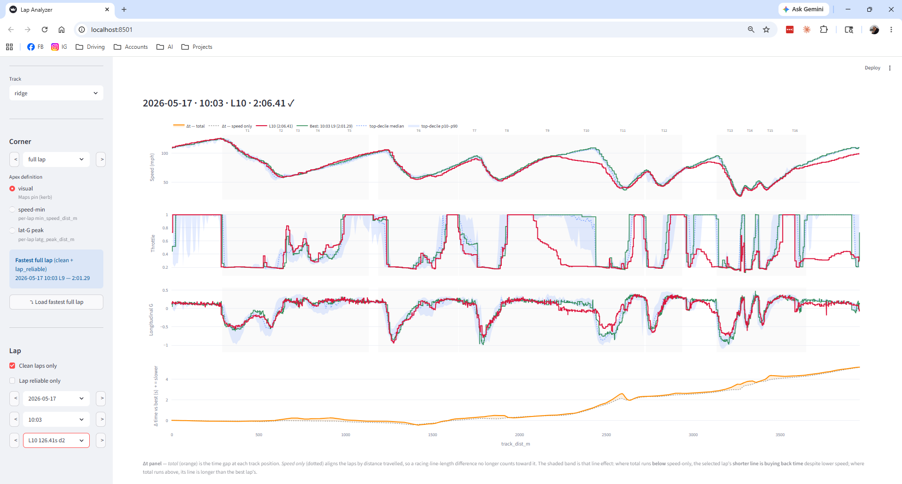

# Lap Analyzer

Lap Analyzer turns [TrackAddict](https://racerender.com/TrackAddict/) CSV
exports into a clean **per-corner transit table across all your sessions** — so
you can ask "what did I do differently through T11 today versus my fastest lap?"
across hundreds of laps, not just within one session. Off-the-shelf tools
(MyRaceLab, RaceStudio, MoTeC i2) are session-scoped and stop at sector
granularity; this is built for cross-session, corner-by-corner analysis of
personal track-day data. It ships with a Streamlit visualizer and sample data so
you can see it working in about five minutes from a fresh clone.



## Quickstart

```bash
git clone <repo-url>
cd lap-analyzer
pip install -e .
```

Then launch the visualizer against the bundled sample data:

```powershell
# PowerShell
$env:DATA_ROOT = "data/samples"; $env:PYTHONPATH = "."; python -m streamlit run visualizer/app.py
```

```bash
# bash
DATA_ROOT=data/samples PYTHONPATH=. python -m streamlit run visualizer/app.py
```

The sample bundle (`data/samples/`) includes 3 sessions each for Ridge and PIR
plus a self-contained corpus, so the picker, comparison bands, and channel
traces all work without any of your own data. Use the **Track** picker in the
sidebar to switch between Ridge and PIR.

To analyze your own data instead, drop TrackAddict CSVs into
`data/raw/<track>/`, leave `DATA_ROOT` unset (it defaults to `data/`), and run
the pipeline — see [docs/PIPELINE.md](docs/PIPELINE.md).

## Supported tracks

- **Ridge Motorsports Park** (`ridge`) — the original track, 16 corners.
- **Portland International Raceway** (`pir`) — 12 corners.

Adding your own track is a data task, not a code task — the pipeline is
track-agnostic. The full bootstrap walkthrough is in
[docs/NEW-TRACK.md](docs/NEW-TRACK.md).

## Inputs

TrackAddict CSV exports (iOS/Android app + OBD reader + external GPS). The full
column contract — which columns are required, how they map to canonical
channels, and how missing OBD is handled — is in
[docs/PIPELINE.md](docs/PIPELINE.md#trackaddict-csv-column-contract).

The pipeline assumes one driver, one car (a Porsche 981 Cayman), and one logging
setup. A few details are tuned to that hardware (notably the accelerometer axis
mapping); see [CONTRIBUTING.md](CONTRIBUTING.md) before pointing it at data from
a different setup.

## How it works

```
TrackAddict CSV ─► normalize ─► label corners ─► flag quality ─► build corpus ─► visualizer
```

1. **normalize** — CSV → tidy parquet + per-lap summary.
2. **label corners** — projects each lap onto a synthetic track centerline,
   GPS-drift-corrects it against hand-pinned apex coordinates, and emits one row
   per corner transit.
3. **flag quality** — corpus-wide reliability flags so analysis can separate
   trustworthy spatial data from GPS-glitched laps.
4. **build corpus** — concatenate every session into one queryable table.

All geometric truth derives from a handful of Google Maps satellite-pinned
corner apexes per track — the only hand-curated input. The reasoning behind that
and every other design choice is in [docs/ARCHITECTURE.md](docs/ARCHITECTURE.md).

## Project layout

```
lap_analyzer/        # the library — one module per pipeline component
  cli/               # one CLI per component (python -m lap_analyzer.cli.<name>)
visualizer/          # Streamlit app + track-specific analysis pages
scripts/             # bootstrap & diagnostic tools (e.g. seed_pir_corners.py)
tracks/              # per-track JSON definitions (ridge.json, pir.json)
docs/                # ARCHITECTURE · PIPELINE · NEW-TRACK
data/
  samples/           # committed demo bundle (3 sessions/track + sample corpus)
  raw/ sessions/ corpus/ notes/   # your data — gitignored, not shipped
```

The full processed corpus is published as a GitHub Release asset; raw CSVs stay
local.

## Documentation

- [docs/PIPELINE.md](docs/PIPELINE.md) — CLI runbook, CSV column contract, output schema.
- [docs/ARCHITECTURE.md](docs/ARCHITECTURE.md) — design rationale and the approaches that were rejected.
- [docs/VISUALIZER.md](docs/VISUALIZER.md) — what the Streamlit app shows and how to read it.
- [docs/NEW-TRACK.md](docs/NEW-TRACK.md) — bootstrap a new track end-to-end.
- [CONTRIBUTING.md](CONTRIBUTING.md) — adding your track, hardware assumptions, conventions.

## License

[MIT](LICENSE) © 2026 Saurav Sengupta.
